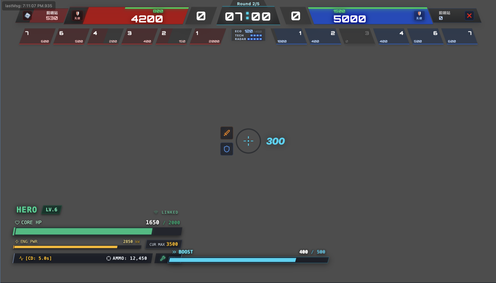

# TODO
- [x] 主 UI MQTT 接收/发送桥接：下行状态经 `HudDataBridge -> hud.gd -> window.godotPush` 进入 React，上行操作经 `emitGodotOperation -> HudOperationBridge` 发送到 MQTT command services。
- [ ] 主 UI 还未提供 `KeyboardMouseControl`、`CustomControl`、`MapClickInfoNotify` 的前端交互入口；底层 `ProtocolAdapter` 已有发送 API，但当前 React 主 UI 没有对应控件或输入捕获逻辑。


# RMSynapse
RoboMaster 2026 自定义客户端（Godot 4.5 + MQTT/Protobuf + UDP 视频）。



## 功能亮点
- Godot 4.5 场景/UI：包含比分、局阶段、全局单位状态、后勤/特殊机制、事件提示、伤害/复活、机器人运行/模块状态、Buff/处罚及远程控制面板，可直接接在 `/root/Mqtt/Adapter` 输出上。
- 统一网络栈：AutoLoad `Mqtt` 聚合 `Adapter`、`Transport`、`ClientSetter`，使用 MQTT 二进制消息 + Protobuf 解码。
- 自定义视频流：C++ GDExtension `RMVideoCanvas` 源码仍保留；当前导出使用 `Control` 占位，需重新编译视频插件后恢复画布节点。
- 上行策略：通过 `ProtocolAdapter` 发送键鼠、自定义控制、地图点击、买血/买弹/复活、部署、符文、装配、性能选择、空中支援、飞镖等命令。
- 协议与生成：`rm_synapse/net/mqtt/proto/rm_custom.proto` 对齐 2026 自定义客户端协议，使用内置 Godobuf 插件生成 `rm_synapse/net/mqtt/proto/generated/rm_custom_pb.gd`。

## 目录速览
- `rm_synapse/`：Godot 工程；`net/mqtt/` 网络脚本，`ui/` 主界面，`bin/` GDExtension 输出，`net/mqtt/proto/` 协议。
- `plugins/rm_video_decoder/`：UDP→FFmpeg 解码 GDExtension 源码（SCons 构建）与 CMake 测试。
- `plugins/rm_common/`：无依赖日志工具（供 C++/Godot 共用）。
- `plugins/godobuf/`、`godot-cpp/`：上游子模块（分别为 Protobuf 生成器、GDExtension SDK）。
- `references/`：RoboMaster 2026 规则/通信协议 PDF。
- `build/`：示例 CMake 构建产物；`rm_synapse/Export/` 为已导出的可执行/脚本。

## 快速开始（直接运行）
1) 准备：安装 Godot 4.5.x；有可访问的 MQTT Broker 以及机器人/裁判系统视频流（默认 H.265 UDP 端口 3334）。  
2) 获取源码：`git clone <repo_url> && cd RMSynapse && git submodule update --init --recursive`。  
3) 配置网络：在 ESC 设置中配置 MQTT Broker、Port、ClientID；默认场景也可在 `rm_synapse/net/mqtt/mqtt.tscn` 里调整 `Transport.broker_url`。  
4) 配置视频：在 ESC 设置中配置图传端口；当前 `RMVideoCanvas` 插件二进制未启用，视频画布是占位节点。  
5) 运行：`godot4 --path rm_synapse` 直接播放主场景；界面自动订阅 MQTT、显示数据并按当前设置发送交互命令。  
6) 可选：使用导出产物 `rm_synapse/Export/linux/`、`rm_synapse/Export/windows/`、`rm_synapse/Export/macos/` 中对应平台文件启动。

## 构建 / 更新 GDExtension
- 依赖（Ubuntu 举例）：
```bash
sudo apt update
sudo apt install build-essential scons pkg-config libavcodec-dev libavutil-dev libswscale-dev \
                 libopencv-dev cmake # OpenCV 仅用于 test_video_show
```
- 重新编译视频解码插件：
```bash
cd plugins/rm_video_decoder
scons platform=linux target=template_release  # 或 template_debug
# 成品位于 rm_synapse/bin/librm_video_decoder.* 和 video_yuv.gdshader
```
- 构建独立测试程序（UDP→FFmpeg→OpenCV 预览）：
```bash
cmake -S plugins/rm_video_decoder -B build
cmake --build build
./build/test_video_show   # 端口默认 3334，可在源码中修改
```
- 其他平台：将 `platform=windows|macos|android`，若交叉编译需先让 `godot-cpp` 获取对应头/模板。构建后确保产物放入 `rm_synapse/bin/` 并与 `rm_video_decoder.gdextension` 指向的文件名一致。

## 网络与协议速览
- 下行订阅（`ProtocolAdapter.DEFAULT_SUBSCRIBE_TOPICS` 默认）：`GameStatus`、`GlobalUnitStatus`、`GlobalLogisticsStatus`、`GlobalSpecialMechanism`、`Event`、`RobotInjuryStat`、`RobotRespawnStatus`、`RobotStaticStatus`、`RobotDynamicStatus`、`RobotModuleStatus`、`RobotPosition`、`Buff`、`PenaltyInfo`、`RobotPathPlanInfo`、`RadarInfoToClient`、`RobotPerformanceSelectionSync`、`DeployModeStatusSync`、`TechCoreMotionStateSync`、`RuneStatusSync`、`SentryStatusSync`、`DartSelectTargetStatusSync`、`SentryCtrlResult`、`AirSupportStatusSync`、`CustomByteBlock`。解码成功的消息会写入状态服务并逐类触发 `*_updated` 信号。  
- 上行：
  - 高频：`KeyboardMouseControl`、`CustomControl`（75 Hz，latest-only，自定义数据最大 30 bytes）。
  - 请求/低频：`RobotPerformanceSelectionCommand`、`HeroDeployModeEventCommand`、`RuneActivateCommand`、`AssemblyCommand`、`DartCommand`、`SentryCtrlCommand`、`AirSupportCommand`。
  - 触发：`CommonCommand`、`MapClickInfoNotify`，支持协议侧最小发送间隔。
- 数据流设计：网络线程只读写线程安全队列，主线程在 `_process` 中批量落地并发信号；发送端 ACK/超时重试、断线可选择丢弃高频包（详见 `rm_synapse/net/data_flow.md` 与 `rm_synapse/net/Readme.md`）。

## 视频流协议与 RMVideoCanvas
- UDP 包头（8 bytes）：`frame_seq:uint16`，`fragment_seq:uint16`，`total_size:uint32`（通常网络字节序）；同帧多分片乱序容忍，16 MB 安全上限。  
- 解码：FFmpeg HEVC 默认，可根据推流选择编译期改 codec；三缓冲避免渲染线程争用。  
- 输出：优先 NV12→自带 Shader（`res://bin/video_yuv.gdshader`），不支持则回退 RGBA；无帧 `no_frame_timeout_sec` 后显示占位纹理。  
- 属性（Inspector）：`port`、`use_bt601`、`use_tv_range`、`force_rgba`、`no_frame_timeout_sec`、`placeholder_texture`、`display_mode(adaptive/stretch/original)`；信号 `stream_state_changed(bool is_streaming)` 可用于 UI 提示。

## UI 模块
- 主界面位于 `react-ui/src/`，构建产物复制到 `rm_synapse/ui/web/` 后由 `rm_synapse/ui/HUD.tscn` 内的 CEF 节点加载。
- 默认主场景 `rm_synapse/Main.tscn` 组合 HUD 与视频占位场景，网络数据经 `hud.gd` 推送到 React。

## Protobuf 工具链
- 协议定义：`rm_synapse/net/mqtt/proto/rm_custom.proto`（RoboMaster 2026 自定义客户端章节）。  
- 重新生成 GDScript（需 Godot 4）：  
```bash
cd rm_synapse
godot4 --headless -s addons/protobuf/protobuf_cmdln.gd \
       --input=net/mqtt/proto/rm_custom.proto \
       --output=net/mqtt/proto/generated/rm_custom_pb.gd
```
- Godobuf UI 版也位于 `addons/protobuf/`，勾选插件后可在编辑器侧栏编译。

## 致谢
- 视频解码依赖 FFmpeg；GDExtension 使用 `godot-cpp` 4.5。  
- MQTT 插件基于 goatchurchprime/godot-mqtt；Protobuf 生成器基于 oniksan/godobuf；C++/Godot 日志共用 `rm_common`。
